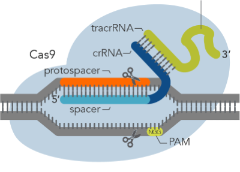
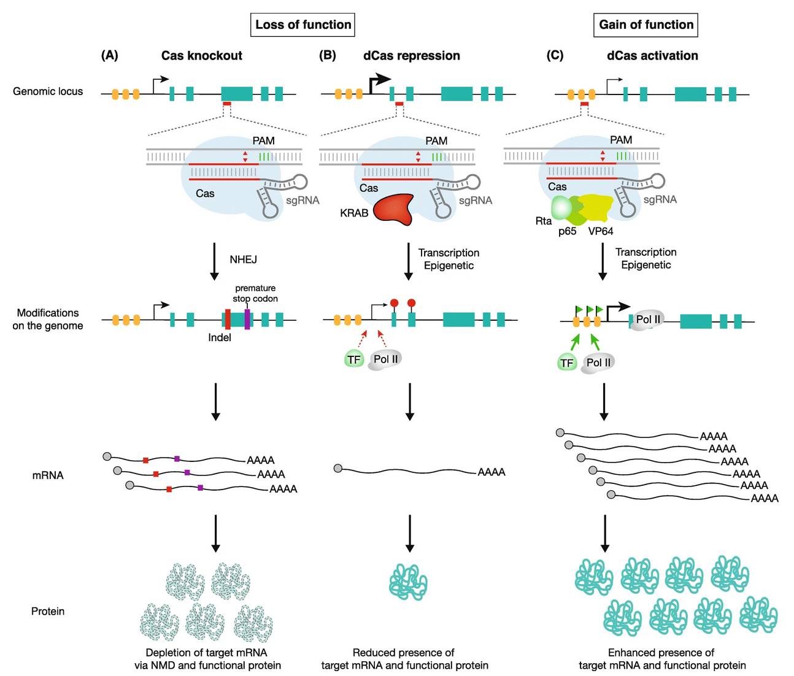

# CRISPRi guide efficiency prediction

## Project Description
The goal of this project was the development of a model to accurately predict guide depletion in publicly available CRISPRi essentiality screens in Escherichia coli, using a variety of sequence, thermodynamic, and transcriptomic features. The efficiency of guide RNAs is measured with genome-wide essentiallity screens and consists of CRISPRi guide sequences targeting essential genes, and depletion of these guides following growth measured by high-throughput sequencing.


## Objectives
The final model should fulfill the following requirements:
1. it should work with only guide features on unseen genes
2. it should generalize well to blind-test data: separate data set of 9 Purine genes with several hundred guides per gene

## Setup

The raw data (guide efficiency values, model features, external validation dataset) can be found in the ```dataset``` folder. The core scripts for data preprocessing, model training setups as well as model evaluation can be found in the ```src``` folder. For each processing step we have a 
seperate notebook wich imports functions from the core scripts. Those notebooks can be found in the ```notebooks``` folder. The performance results as well as the generated plots are stored in the ```reports``` folder. 

To be able to import the functions from the core scripts, please run this setup:

```
$ python -m pip install -e .
```


## Background

### CRISPRi essentiality screens in bacteria to measure guide RNA efficiency
CRISPR inactivation (CRISPRi) uses a deactivated Cas9 (dCas9) to target the promoter or protein-coding region of the chosen gene and works in tandem with repressor domains (e.g., KRAB) to inhibit gene transcription.

Genome-wide essentiallity screens can be divided into the following steps (see Figure):

- generate a library of oligos with various sequence features, with each oligo encoding a different sgRNA sequence, and thus a different DNA target
- clone the oligo library onto a lentiviral vector system to facilitate cellular delivery, integration, and expression
- transduce guides plasmids into bacteria that express dCas9 system
- let bacteria grow and measure guide abundance before and after the experiment through high-
throughput sequencing
- calculate the log2FCas a measure for guide RNA efficiency: *log2FC = log( guides abundance before / guide abundance after )* 


### Genome Editing with CRISPR-Cas9

**CRISPR:** clustered regularly interspaced short palindromic repeats

- based on a simplified version of the bacterial CRISPR-Cas9 antiviral defense system
- a genetic engineering technique by which the genomes of living organisms can be modified

Introduction to CRISPR:

- *Videos:*
  - https://www.youtube.com/watch?v=2pp17E4E-O8
  - https://www.youtube.com/watch?v=4YKFw2KZA5o
- *Paper:* 
  - https://www.ncbi.nlm.nih.gov/pmc/articles/PMC4253859/
  - https://www.ncbi.nlm.nih.gov/pmc/articles/PMC4441801/

#### CRISPR/Cas9 system

The whole purpose of the CRISPR system is to protect bacteria from invading viruses. When a virus attacks bacteria, the cells mount a primitive immune response. Any bacteria that survive infection keep a part of the viral DNA as a way to remember the past infection so they can fight off the virus easier next time. This DNA souvenir is stored in the bacterial genome between CRISPR sequence repeats. In future, if the same virus invades again, the bacterial cell now has a complementary RNA sequence which recruits the Cas nuclease to cut the viral DNA and stop the infection. 

- there are two key components in the CRISPR-Cas9 gene editing system: 
  - small guide RNA (sgRNA): the engineered sgRNA guides Cas9 to a specific target DNA segment
  - Cas9 (CRISPR-associated protein 9): protein that has two nuclease domains (RUVC and HNH), which cleave the non-complementary and complementary strand, respectively, to introduces double-stranded cuts in the DNA
- a double-stranded DNA break will be generated at the target site
- this DNA damage activates a normal but error-prone cellular process to repair double strand breaks
- cutting introduces DNA mutations and results in complete loss-of-function of the targeted gene

**Guide RNA:**

- sgRNA consisting of a tracrRNA (trans-activating crispr RNA), which is a scaffold sequence necessary for Cas-sgRNA-binding, and crRNA (CRISPR RNA), which contains the user-defined ∼20 nucleotide spacer that defines the genomic target to be modified and the protospacer adjacent motif that is required for Cas9 activity at the target site
- Protospacer Adjacent Motif (PAM) Sequence:
  - short DNA sequence, about 2-6 nucleotides, downstream of the DNA sequence targeted by the guide RNA 
  - the Cas endonuclease cuts 3-4 nucleotides upstream of it
  - each Cas endonucleases, isolated from different bacterial species, recognizes a different PAM
  - most commonly used Cas9 from Streptococcus pyogenes recognizes the PAM sequence 5′-NGG-3′ (where “N” can be any nucleotide base)



### Alteration of gene transcription with CRISPRi / CRISPRa

- compared with CRISPR cutting approaches, CRISPRi / CRISPRa is inducible, reversible, and non-toxic and also enables knockdown of non-coding RNAs
- CRISPRi and CRISPRa enable control of gene transcription by several orders of magnitude and have been shown to exhibit few off-target effects, meaning the technique primarily affects only the intended genes

#### CRISPRi / CRISPRa System

- replacing normal endonuclease Cas9 protein with a catalytically dead Cas9 (dCas9), which has other functional proteins fused to it
- dCas9-fusion proteins are recruited to DNA sequences via sgRNA, but the catalytically inactive dCas9 cannot cut the DNA
- instead, the proteins fused to dCas9 manipulate transcription of the targeted genes
- CRISPR interference (CRISPRi): Kruppel associated box (KRAB) is fused to dCas9 --> transcription is repressed  
- CRISPR activation (CRISPRa): SunTag (a sequence containing multiple copies of the activator recruitment domain of general control protein 4) is fused to dCas9 --> transcription is activated


