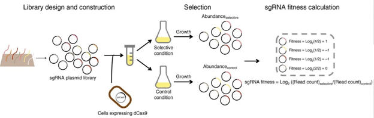
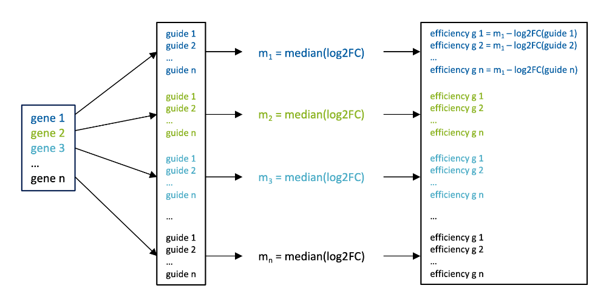
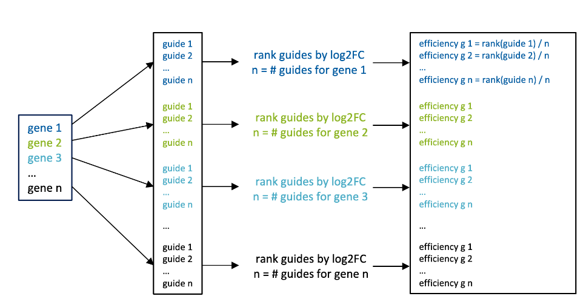
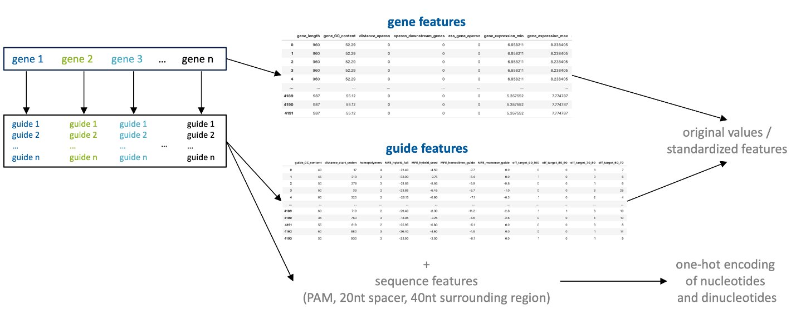
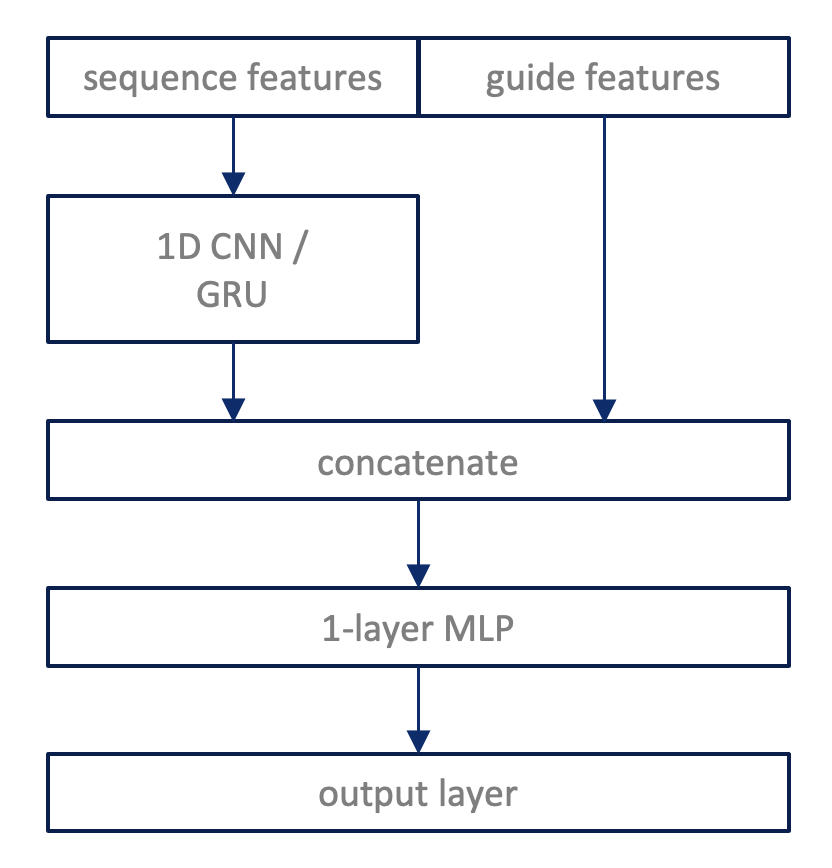
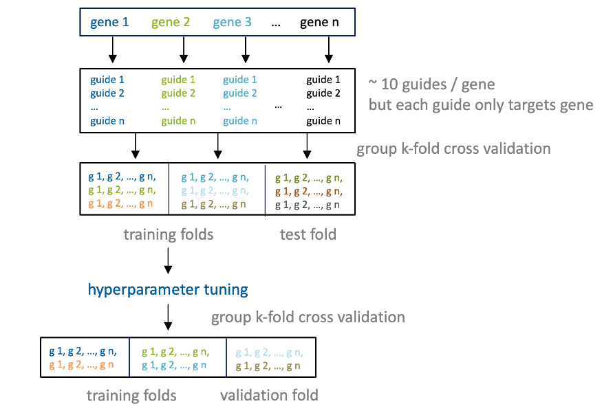

\tableofcontents

\newpage

# Introduction

## Project Description

The goal of this project was the development of a model to accurately predict guide depletion in publicly available CRISPRi essentiality screens in *Escherichia coli*, using a variety of sequence, thermodynamic, and transcriptomic features. The efficiency of guide RNAs is measured with genome-wide essentiallity screens and consists of CRISPRi guide sequences targeting essential genes, and depletion of these guides following growth measured by high-throughput sequencing.


## CRISPRi essentiality screens in bacteria to measure guide RNA efficiency

CRISPR inactivation (CRISPRi) uses a deactivated Cas9 (dCas9) to target the promoter or protein-coding region of the chosen gene and works in tandem with repressor domains (e.g., KRAB) to inhibit gene transcription.

Genome-wide essentiallity screens can be divided into the following steps (see Figure 1):

- generate a library of oligos with various sequence features, with each oligo encoding a different sgRNA sequence, and thus a different DNA target
- clone the oligo library onto a lentiviral vector system to facilitate cellular delivery, integration, and expression
- transduce guides plasmids into bacteria that express dCas9 system
- let bacteria grow and measure guide abundance before and after the experiment through high-throughput sequencing
- calculate the log2FC: *log( guides abundance before / guide abundance after )* as a measure for guide RNA efficiency




## Objectives

The final model should fulfill the following requirements:

1. it should work with only guide features on unseen genes
2. it should generalize well to blind-test data: separate data set of 9 Purine genes with several hundred guides per gene

\newpage

# Data 

Here we describe what data we have and how we preprocess this data for further analysis.


## Guide RNA Efficiency Data Sets

We got log2FC values for genome-wide essentiallity screens from two different publications.  

- [*Pooled CRISPR interference screening enables genome-scale functional genomics study in bacteria with superior performance* ](https://www.nature.com/articles/s41467-018-04899-x) from Wang, 2018 
  - one dataset
  - library: ~ 60.00 sgRNAs
  - E. coli MCm (a K12 MG1655 derivative with an integrated chloramphenicol-resistance cassette) carrying pdCas9-J23111
- [*A CRISPRi screen in E. coli reveals sequence-specific toxicity of dCas9*](https://www.nature.com/articles/s41467-018-04209-5) from Cui, 2018 
  - two datasets
  - library: ~ 92.000 sgRNAs
  - E. coli K12 MG1655
  - two different expression systems: E18 (higher dCAS expression) & E75 (lower dCAS expression): strain LC-E75 carries a fine-tuned Ptet-dCas9 cassette which was used to perform a genome-wide dCas9 knockdown screen following the same protocol as the screen previously performed with strain LC-E18. As expected, many guides that produced a strong fitness defect in strain LC-E18 had a weaker or no effect in strain LC-E75, but targets in the coding strand of essential genes still produced a strong fitness defect
  - Data taken from Supplemental Table 5

In total, we have three different data sets for CRISPRi guide efficiency: ```wang```, ```cui E18``` and ```cui E75```.
All screens were done on *E.coli* str. K-12 substr. MG1655. The genome can be found [here](https://www.ncbi.nlm.nih.gov/nuccore/NC_000913.3?report=fasta) (NCBI accession number: NC_000913.3).


## Preprocessing of Guide RNA Efficiency Data Sets 

The three data sets contain 60.000 - 90.000 guides targeting different types of genes in the *E.coli* genome. We excluded certain genes with their guides from our dataset based on filtering criteria that were used in other studies before:

Filtering criteria from Pasteur Model from [*Calvo-Villamañán et al, 2020*](https://academic.oup.com/nar/article/48/11/e64/5827197):

- Coding strand == 1
- Number guides per gene > 4
- Median log2FC per gene < -2
  
and Filtering criteria from Yan (HZI):

- gRNAs targeting essential genes ("gene_essentiality" == 1)
- Coding strand ("coding_strand" == 1)
- Not in intergenic region ("intergenic" == 0)


We applied a combination of both filtering approaches resulting in the following filtering criteria:

- gRNAs targeting essential genes ("gene_essentiality" == 1)
- Coding strand ("coding_strand" == 1)
- Not in intergenic region ("intergenic" == 0)
- number guides per gene > 4
- median log2FC per gene < -2

We applied the filtering on all three data sets and end up with the following number of guides per dataset:

- ```wang```: 3391 guides
- ```cui E18``` 1387 guides
- ```cui E75```: 1313 guides

On average we have ~ 10 guides / gene but each guide is associated with only one gene.

## Log2FC as a Measure for Guide RNA Efficiency

**Problem:** log2FC can only serve as a proxy for guide RNA efficiency because it contains confounding gene effects, e.g. guides targeting highly expressed genes might have in general higher efficiencies than guides targeting lowly expressed genes


**Approaches for Separation of Gene and Guide Effects:**

- Batch effect and confounding factor correction methods do not work because we only have one condition not multiple conditions (e.g. control and disease) from which those effects could be calculated 

- ***median subtraction***: Removes gene effect from target by taking the median log2FC over all guides per gene and then subtracting the median from each guide log2FC of that gene (see Figure 2)
  - source: Pasteur model from [*Calvo-Villamañán et al, 2020*](https://academic.oup.com/nar/article/48/11/e64/5827197)
  - pros: quantitative measure
  - cons: we cannot be sure that the median is a good representation of the gene effect
  
{width=50%}
  
- ***normalized ranks***: Removes gene effect from target by ranking all guides of each gene by their log2FC and then calculating a normalized rank by dividing the rank by the number of guides per gene (see Figure 3)
  - source: [*Doench et al., 2014*](https://www.nature.com/articles/nbt.3026) and [*Doench et al, 2016*](https://www.ncbi.nlm.nih.gov/pmc/articles/PMC4744125/#SD2)
  - pros: ranking value is not influenced by gene effects
  - cons: measure is not quantitative and hence does not show when guides have very similar log2FCs

{width=50%}

- Predicted log2FC: log2FC predicted from only gene features
  - did not lead good model performances (not further described here in the report)

\newpage

## Model Features and Preprocessing

For the modeling task we have different types of input features. We have tabular data for genes (e.g. GC content of a gene, gene expression values) and guide RNAs (e.g. minimum free energy or off-targets) as well as sequence features for the guide RNAs: sequence of the PAM, the 20 nt spacer region as well as the 40 nt region surrounding PAM and spacer sequence (4 nt upstream and 16 nt downstream of spacer sequence).




We preprocessed the tabular and sequence data in the following way:

Preprocessing of tabular data:

- we removed the following features from the tabular data: 
  - ```geneid``` (only use for group k-fold)
  - ```distance_operon_perc``` because it highly correlates with ```distance_operon```
  - ```distance_start_codon_perc``` because it highly correlates with ```distance_start_codon```
- we log2 transformed gene expression measures
- for tree-based methods we kept the original values, because they don't need standardization of input features
- for all other methods we standardized all features with z-score transformation 

Preprocessing of sequence features:

- sequence features for shallow models: 
  - one-hot encoding of nucleotides for PAM and 20 nt spacer 
  - one-hot encoding of di-nucleotides for 40 nt surrounding region
- sequence features for deep models: 
  - one-hot encoding (matrix: sequence x alphabet) of 40 nt surrounding region $\to$ since the 40nt region already contains the PAM and spacer sequence we don't encode it seperately for the deep models


\newpage

# Models

To select suitable model types for the prediction of guide RNA efficiency, we started with a literature review. We listed some of the most popular models in the section below. 

## Existing Guide RNA Efficiency Prediction Models

There already exist different models that do guide RNA efficiency prediction. We listed a few here:

- Pasteur model:
  - methods: L1-regularized (Lasso) linear regression
  - dataset: cui E75 with median subtraction approach to remove gene effects
  - performance measure: pearson and spearman
  - [paper](https://academic.oup.com/nar/article/48/11/e64/5827197) and [repo](https://gitlab.pasteur.fr/dbikard/ecowg1) 
- Doench model:
  - methods: 
    - linear regression
    - L1-regularized (Lasso) linear regression
    - L2-regularized (Ridge) linear regression
    - the hybrid SVM plus logistic regression approach
    - Random Forest 
    - Gradient-boosted regression tree
    - L1 logistic regression (a classifier)
    - SVM Classification
  - dataset: A375, HT29, 293T, MOLM13, BV2 cell lines with normalized rank approach to remove gene effects
  - performance measure: FDR
  - [paper 2014](https://www.nature.com/articles/nbt.3026) and [paper 2016](https://www.ncbi.nlm.nih.gov/pmc/articles/PMC4744125/#SD2) 
- Fusi et al.: 
  - Lasso model
  - [paper](https://www.biorxiv.org/content/10.1101/021568v1.full.pdf) 
- Existing Application of Deep Learning Models on Guide efficiency prediction
  - LSTM: [paper](https://www.nature.com/articles/s41467-019-12281-8) 
  - CNN: [paper](https://www.nature.com/articles/nbt.4061#Sec21) 


## Our Guide RNA Efficiency Prediction Models

The literature review revealed that there is no trend towards a specific model type but instated a wide range of models is applied to predict guide RNA efficiency. Hence, we decided to train different shallow and deep models (all regression models) and then compare the results on a held out test set. To get a baseline to which we could compare the more complex models to, we included some simple linear models as well:

*Baseline Models*

- ***linear***
- ***Elastic Net*** (combination of L1 and L2 regularization, which accounts for feature selection (Lasso) but also makes sure that correlated features are shrinked together (Ridge))

*Shallow Models*

- ***Random Forest***
- ***Random forest + RFE*** (Recursive Feature Elimination)
  - for RFE one should not use Gini index because it is biased towards variables with many possible split points (not good if binary, e.g. dummy variables, are included)
  - better to use mean decrease in accuracy (MDA)
  - problem: RFE with MDA takes too long $\to$ we used gini index although not optimal
- ***Mixed Effect RF***:
  - fixed effects (guide) and random effects (gene) are learned separately
  - unseen genes only use fixed effects
  - [paper](https://towardsdatascience.com/mixed-effects-random-forests-6ecbb85cb177)
- ***GBM***

*Deep Models*

- ***1D CNN***
  - filters slide over sequence position
  - sequence and tabular features are processed separately and concatenated in the last layer (see Figure 5)
- ***GRU*** (similar to LSTM)
  - sequence positions are hidden states
  - sequence and tabular features are processed separately and concatenated in the last layer (see Figure 5)


{width=50%}


# Training

We trained all listed *baseline*, *shallow* and *deep* models on the preprocessed feature set with either the median subtracted or the normalized rank log2FC as target. The final models were trained on guide features only, since one of the requirements of the final model is that predictions can be done solely on guide features. The only exception are the two MERF models, which use the gene features as random effects in the training but then only use the fixed effect for prediction on useen genes. For the training, we divided the dataset into training and test set and split the training set further into training and validation set for hyperparameter tuning (see Figure 6). Since the model should generalize to guides of new genes, we used a special type of cross-validation, called group k-fold cross-validation. In group k-fold cross-validation the folds are divided according to a pre-defined group, in our case the group are the genes. This ensures that the test set contains only guides of unseen genes, which better reflects the actual performance of the model when applied to new data, later on.

{width=80%}

## Crossvalidation

For all cross-validation steps, we use group k-fold cross-validation (which splits guides into folds according to their gene-affiliation) to make sure that we test on guides of unseen genes. We use two seperate rounds of cross-validation. The "outer" cross-validation is used to access the stability of the model performance, i.e. does the performance change when we predict on a different test set? The "inner" cross-validation is used to tune the hyperparameters of each model and then choose the best set of hyperparameters. 

Note: the folds we generate are exactly the same for all trained models to make sure that results are comparable across models.

- model stability: we use 5 fold cross-validation (outer folds) to calculate the performance of the final model to make sure that we don't calculate the model performance on a particularly "good" or "bad" held out test set 
  - ***training/validation set***: 4 folds are used for training and hyperparameter tuning of the model
  - ***test set***: 1 fold is used to get performance of the final model 
  - final performance: average performance on the 5 independent test sets 
  - final predictions: aggregated predictions made on the 5 independent test sets
- hyperparameters tuning: we use 5 fold cross-validation (inner folds) to get the performance for different hyperparameter sets
  - ***training set***: 4 folds are used for training of the model
  - ***validation set***: 1 fold is used to get the performance of the model for a specific set of hyperparameters
  - final model: we choose the set of hyperparameter that gives the best validation performance for the final model (which is then used to access model stability, final performance and predictions)


## How to Combine Different Data Sets

*First approach:* we combined ```wang``` and one of the ```cui``` data sets and then tested on the second ```cui``` data set. This approach had to the following problem: both ```cui``` datasets are very similar and hence, it's like training on the test set.

*Second approach:* we divided the ```wang``` data set into training and test set (using grouped k-fold cross-validation) and then added (one or both) ```cui``` data sets to the training set. Here we made sure that we only add guides of the ```cui``` data set to the ```wang``` training set, which are not from genes that are in the ```wang``` test set. This was done again to make sure that we test on unseen genes.

Using this approach we end up with the following dataset combinations for model training:

- ```wang``` 
- ```cui E18```
- ```cui E75```
- ```wang``` + ```cui E18```
- ```wang``` + ```cui E75```
- ```wang``` + ```cui E18``` + ```cui E75```

\newpage

# Evaluation

In this section we describe in detail how we evaluated the different *baseline*, *shallow* and *deep* models trained on the data set combinations listed above.

## Metrics used for Evaluation of Model Performance

To evaluate and compare the performance of the different trained *shallow* and *deep* models, we calculate the model performance based on the model predictions on the held out test sets (recall: we use 5 fold cross-validation so we have 5 independent test sets). The two metrics we used to calculate the model performance are: mean squared error (MSE) and Spearman correlation. 

We trained eight different models on the six aforementioned datasets with a median subtracted and a normalized rank target. The performance results on the test set are shown in Table 1 for MSE metric and in Table 2 for Spearman correlation metric.

```{r, performances_mse, message = FALSE, warning = FALSE, echo = FALSE}

library(dplyr)
library(knitr)
library(kableExtra)

column_order = c(1,3,5,7,9,11,2,4,6,8,10,12)

# filenames
file_mse_shallow = "../performance_training/2021-4-13/shallow_models_mse_test.csv"
file_mse_merf = "../performance_training/2021-4-13/merf_mse_test.csv"
file_mse_deep = "../performance_training/2021-4-13/deep_models_mse_test.csv"

table_mse_shallow = read.csv(file_mse_shallow)
table_mse_shallow = dplyr::filter(table_mse_shallow, !grepl('guide-genes|orig', X))
colnames(table_mse_shallow)[1] = "dataset"

table_mse_merf = read.csv(file_mse_merf)
table_mse_merf = dplyr::filter(table_mse_merf, !grepl('guide-genes|orig', X))

table_mse_deep = read.csv(file_mse_deep)
table_mse_deep = dplyr::filter(table_mse_deep, !grepl('guide-genes|orig', X))

table_mse_shallow$MERF_RF = table_mse_merf$RF
table_mse_shallow$MERF_GBM = table_mse_merf$GBM
table_mse_shallow$oneD_CNN = table_mse_deep$X1DCNN
table_mse_shallow$GRU = table_mse_deep$GRU

table_mse_shallow = table_mse_shallow[column_order,]
rownames(table_mse_shallow) <- NULL
table_mse_shallow$dataset = gsub("rousset","cui",table_mse_shallow$dataset)

table_mse_shallow %>% kable(caption = "MSE for listed models (columns) trained on different datasets (rows)") %>% kable_styling(font_size = 6, latex_options = "hold_position")


```

```{r, performances_correlation, message = FALSE, warning = FALSE, echo = FALSE}

column_order = c(1,3,5,7,9,11,2,4,6,8,10,12)

# filenames
file_mse_shallow = "../performance_training/2021-4-13/shallow_models_spearmanR_test.csv"
file_mse_merf = "../performance_training/2021-4-13/merf_spearmanR_test.csv"
file_mse_deep = "../performance_training/2021-4-13/deep_models_spearmanR_test.csv"

table_mse_shallow = read.csv(file_mse_shallow)
table_mse_shallow = dplyr::filter(table_mse_shallow, !grepl('guide-genes|orig', X))
colnames(table_mse_shallow)[1] = "dataset"

table_mse_merf = read.csv(file_mse_merf)
table_mse_merf = dplyr::filter(table_mse_merf, !grepl('guide-genes|orig', X))

table_mse_deep = read.csv(file_mse_deep)
table_mse_deep = dplyr::filter(table_mse_deep, !grepl('guide-genes|orig', X))

table_mse_shallow$MERF_RF = table_mse_merf$RF
table_mse_shallow$MERF_GBM = table_mse_merf$GBM
table_mse_shallow$oneD_CNN = table_mse_deep$X1DCNN
table_mse_shallow$GRU = table_mse_deep$GRU

table_mse_shallow = table_mse_shallow[column_order,]
rownames(table_mse_shallow) <- NULL
table_mse_shallow$dataset = gsub("rousset","cui",table_mse_shallow$dataset)

table_mse_shallow %>% kable(caption = "Spearman correlation for listed models (columns) trained on different datasets (rows)") %>% kable_styling(font_size = 6, latex_options = "hold_position")


```


Comparing the model performances based on MSE and Spearman correlation, we make the following observations:

- for the linear models, the regularized linear model (elastic net) outperforms the simple linear model on all datasets
- for the tree-based models, the GBM model outperforms the random forest model with and without recursive feature elimination on all datasets
- the mixed effect models that use a random forest or GBM for the fixed effects perform worse on unseen genes than the simple random forest and GBM models
- for the deep models, the 1D CNN slightly outperforms the GRU model on all datasets

Those observations are more pronounced for the median subtracted targets than for the normalized rank targets. Comparing the Spearman correlation for the two different target types (MSE cannot be used for this comparison), the median subtracted targets seem to lead to better model performances than the normalized rank targets in general. 

Comparing the model performances on the different datasets, we observe that training on ```cui E75``` dataset (aslo in combination with ```wang``` and ```cui E18```) leads to a worse performance than training on ```wang``` or ```cui E18```. Also, combining datasets, e.g. ````wang + cui E18```, does not greatly improve the performance of the trained models. Furthermore, we compared how the models perform when trained on gene and guide features, compared to models trained on guide features only, to see how good the median subtraction and normalized rank approaches capture the gene-specific information. For all models, both feature sets lead to very similar results (not shown here), e.g. for the Elastic Net model trained on the ```wang``` dataset, the MSE (on test set) for guide only features is 4.04 (median subtracted) and 0.84 (normalized rank), while it is 4.14 (median subtracted) and 0.86 (normalized rank) for gene and guide features. This shows that both approaches seem to remove the gene-specific information from the log2FC quite well. However, it should be noted that the models trained on the original log2FC and gene and guide features still show the best performance, e.g. Elastic Net trained on ```wang``` dataset has a Spearman correlation of 0.408 compared to 0.351 (median subtraction) and 0.33 (normalized rank).

To investigate the impact of sequence feature engineering, we additionally trained all *baseline* and *shallow* models on a feature set that uses a k-mer representation of the sequence features instead of the one-hot encoding. Table 3 shows the performance results for those models measured by MSE. If compared to the performance results of the models trained on the one-hot encoded sequence features (Table 2) we can clearly see that the models trained on k-mer sequence features perform worse. From those results we conclude that not a specific sequence content (k-mers) seems to be important for the guide efficiency but rather certain nucleotides at specific positions.


```{r, performances_k_mers, message = FALSE, warning = FALSE, echo = FALSE}

column_order = c(1,3,5,7,9,11)

# filenames
file_mse_shallow = "../performance_training/2021-4-19/kmer_model/shallow_models_mse_test.csv"

table_mse_shallow = read.csv(file_mse_shallow)
table_mse_shallow = dplyr::filter(table_mse_shallow, !grepl('guide-genes|orig|rank', X))
colnames(table_mse_shallow)[1] = "dataset"

table_mse_shallow$dataset = gsub("rousset","cui",table_mse_shallow$dataset)

table_mse_shallow %>% kable(caption = "MSE for listed models (columns) trained on different datasets (rows) and k-mer sequence features") %>% kable_styling(font_size = 6, latex_options = "hold_position")

```


The conlucsions we make in this section are based on the two chosen metrics for evaluation. However, both evaluation metrics have certain drawbacks:

*Mean Squared Error (MSE):* the results are not directly comparable among different target processing steps (median subtraction vs normalized rank). Scaling of results would be needed for comparability.

*Spearman correlation:* if all guides for a given gene have very similar efficiencies, small differences in our models' predictions can have a large impact on the Spearman correlation coefficient although the model still predicts the highest efficiency for the top guides. In practice, it means that the predictions of the model don't reflect the original ranking very well, however the values of the original guide efficiencies are so close that even in reality this ranking might not be true due to measurement errors. In conclusion, the Spearman correlation coefficient is only a good metric for cases in which the distribution of guide efficiency per gene is spread and not very narrow. An example for both cases can be found in Figure 7 (for narrow distributions that lead to bad correlations) and Figure 8 (for spread distributions that lead to good correlations). In the plots, we show the original log2FC value of the guide predicted as top 1 guide (guide with the highest predicted efficiency) for a specific gene vs the original log2FC for the remaining guides of that gene. The prediction and Spearman correlation (the correlation is only calculated based on the guides of the shown gene) are shown for the Elastic Net model trained on the ```wang + cui E18``` dataset. Figure 7 shows that although the Spearman correlation for gene b0094 is low, the model is able to pick one of the highest efficient guides as top 1 ranked guide. On the contrary, in Figure 8 we can see that the correlation for gene b0098 is quite high although the models is *not* able to predict the actual best guide as top ranked guide.


## Ranking as Alternative Metric for Evaluation of Model Performance

Since one of the primary goals is to build a model that helps to pick the most efficient guides from a set of guides for a specific gene (e.g. pick the top N most efficient guides), one alternative evaluation approach would be a ranking approach. 

The idea of the ranking approach is the following:

- for each gene $a = 1,...,n$:
  - select all guides for gene $a$: guides $g_{a1} ,...,g_{am}$ 
  - rank guides $g_{a1} ,...,g_{am}$ by the predictions made with one of the models based on guide features and median subtracted (reversed ranking because the more negative the predicted log2FC, the better the guide) or normalized rank targets (non-reversed ranking because the higher the normalized rank, the better the guide)
  - select top N ranked guides, with N = 1,..3
  - for top N ranked guides: retrieve their original log2FC values and take the mean of the original log2FC over the top N ranked guides $\to$ ```mean_top_n_guides```
  - for the remaining guides ($all\ guides - top\ N\ ranked\ guides$): retrieve their original log2FC values $\to$ ```guide_distribution```
  - calculate p-value of a one sample wilcoxon rank statistical test: 
  ```wilcoxon_p = wilcoxon(guide_distribution - mean_top_n_guides, alternative='greater')``` to test if the log2FC of the top N guides are significantly higher than the log2FC of the remaining guides
- count how many genes have significant difference (significance level: 0.05) $\to$ ```significant genes```
- rank the models by their number of ```significant genes``` 

The results of the ranking evaluation are shown in Figure 9 for the models trained on median subtracted targets and in Figure 10 for the models trained on normalized rank targets. Figure 9, upper left panel, shows that for the median subtracted target, the Elastic Net model ranks the best for top 1 ranked guides, i.e. it has the highest number of of significant genes across different datasets if we select the top 1 ranked guide for each gene. However, if we consider the top 3 ranked guides (Figure 9, lower left panel), the 1D CNN model ranks better than the Elastic Net model. Figure 10, upper left panel shows that for the normalized rank target, the 1D CNN model ranks the best for top 1 ranked guides. However, if we consider the top 3 ranked guides (Figure 9, lower left panel), the Elastic Net model ranks better than the Elastic Net model. 


{width=80%}

{width=80%}


In general, we observe again that for both target types (median subtracted and normalized rank) the regularized (Elastic Net) linear model outperforms the simple linear model, the GBM outperforms the Random Forest model on top 3 ranked guides (but not on top 1 ranked guides) and the 1D CNN outperforms the GRU model (exception is top 1 ranked guides on median subtracted dataset). Hence, the results of the ranking evaluation are in good agreement with the results of the performance evaluation done with MSE and Spearman correlation. 

One observation that should be considered when interpreting the results of the model ranking is that the actual number of significant genes, on which the ranking is based on, is not dramatically different between the models, e.g. the right panels of Figure 9 and 10 show that all models trained on the ```wang``` dataset have about 120-130 significant genes.


The ranking can be done dataset-wide as well:

- for each gene $a = 1,...,n$:
  - select all guides for gene $a$: guides $g_{a1} ,...,g_{am}$ 
  - rank guides $g_{a1} ,...,g_{am}$ by the predictions made with one of the models based on guide features and median subtracted (reversed ranking because the more negative the predicted log2FC, the better the guide) or normalized rank targets (non-reversed ranking because the higher the normalized rank, the better the guide)
  - select top N ranked guides, with N = 1,..3
  - for top N ranked guides: retrieve their original log2FC values and take the mean of the original log2FC over the top N ranked guides $\to$ ```mean_top_n_guides```
  - for the remaining guides ($all\ guides - top\ N\ ranked\ guides$): retrieve their original log2FC values *and take the mean of the original log2FC over the remaining guides* $\to$ ```means_remaining_guides```
- save ```means_top_n_guides``` and ```mean_remaining_guides``` for all genes 
- calculate p-value of a two sample wilcoxon rank statistical test: ```wilcoxon_p = wilcoxon(means_remaining_guides, means_top_n_guides, alternative='greater')``` to test if there is a significant difference between the guide efficiency of top N vs remaining guides *over all genes*

An example is shown for the Elastic Net model trained on the ```wang + cui E18``` and the median subtracted target in Figure 11 and the normalized rank target in Figure 12. Figure 11 and 12 clearly show that the distribution of original log2FC values of the top 1 and top 3 (mean original log2FC of top 3 ranked guides) ranked guides is significantly (significance level: 0.05) different from the background guide distribution (mean of original log2FC of remaining guides). This indicates that our models are able to give high scores to highly efficient guides and hence, are able to pick the most efficient guides from a set of guides for a specific gene, which in turn is one of the primary goals of this tool.


## Model selection with *challengeR*

In the last two sections we described different evaluation approaches and concluded the following:

- for each model category (*baseline*, *shallow* and *deep*) we had one model that performed best for most datasets: Elastic Net (*baseline*), GBM (*shallow*) and 1D CNN (*deep*)
- training the models on the ```cui E75``` dataset leads to a worse performance than training on ```wang``` or ```cui E18```
- combining datasets does not greatly improve model performance
- median subtracted targets lead to better model performances than the normalized rank targets on average

Furthermore, we observed that there are no dramatic differences in performance between the Elastic Net, GBM and 1D CNN models. To get a better comparison of the best performing models of each model category, we performed an additional analysis with ```ChallengeR```. The ```ChallengeR``` package provides a set of methods to comprehensively analyze and visualize the results of single-task and multi-task challenges and offers an intuitive way to gain important insights into the relative and absolute performance of algorithms. For further reading please see [paper](https://pubmed.ncbi.nlm.nih.gov/33504883/) and [github](https://github.com/wiesenfa/challengeR).

Here, we use ```ChallengeR``` to compare the performances of the best models of each category (Elastic Net, GBM and 1D CNN) on the datasets (```wang``` and ```cui E18```) and the target (median subtracted) that showed the best performance.

To perform the ```ChallengeR``` analysis we need to define the following properties:

- Tasks (in case of multi-task challenges)
- Test Case
- Algorithms
- Metric Value

In our case, we define the datasets as different Tasks because each dataset is created independently and we train different models for each dataset. We define each gene as a Test Case, because we are interested in the model performance per gene, i.e. the model should be able to pick a good guide for a specific gene. Note, we only use genes with more than 10 guides for this analysis to get a reliable performance measure. In addition, we define each model as an Algorithm and as Metric Values we use the MSE over all guides per gene (gene-wise MSE), Spearman Correlation per gene as well as the original log2FC values of the top 1 and top 3 (mean original log2FC of top 3 ranked guides) ranked guides. This leads to the following specifications:

- Tasks (Dataset):
  - ```wang```
  - ```cui18```

- TestCases (Genes):
  - 228 genes (```wang```)
  - 46 genes (```cui18```)

- Algorithms (Models):
  - Elnet
  - GBM
  - 1D CNN
  
- MetricValue:
  - MSE
  - Spearman correlation coefficient
  - original log2FC of top 1 ranked guide
  - mean of original log2FC of top 3 ranked guides
  

One of the representation, that is provided by the ```ChallengeR``` report is a stacked frequency plot of the observed ranks, separated by algorithm. Observed ranks across bootstrap samples (we specify 1000 bootstrap samples here) are displayed with coloring according to the task. For algorithms that achieve the same rank in different tasks for the full assessment data set, vertical lines are on top of each other. Vertical lines allow to compare the achieved rank of each algorithm over different tasks. We show this representation in Figure 13. Figure 13 shows that 1D CNN ranks the best (most pronounced for MSE) across the three evaluated models. However, this differences in ranking is not striking for Spearman R, top 1 and top3 ranked guides. Furthermore, we observe that 1D CNN shows a robust performance across datasets, i.e. it ranks equally well for each dataset (red and blue bars have the same height more or less).


 

Since the 1D CNN model ranks best across models and shows a robust performance across datasets, we choose to use the 1D CNN model for evaluation on the external dataset, described in the next paragraph.


## Evaluation on External Dataset (Purine Genes) 

For an independent evaluation of the 1D CNN model, we predicted the guide efficiency of nine purine genes with the 1D CNN model trained with the median subtracted target on the ```wang``` and ```cui E18``` datasets. The external evaluation set contains nine purine genes with 750 guides, ranging from 35 to 220 guides per gene (*Purine A* - 64 guides, *Purine C* - 37 guides, *Purine D* - 77 guides, *Purine E* - 35 guides, *Purine F* - 92 guides, *Purine H* - 114 guides, *Purine K* - 56 guides, *Purine L* - 220 guides, *Purine M* - 47 guides). The guide log2FC was calculated for 3 different time points (*OD02*, *OD06* and *OD1*). Since the log2FC of all three timepoints highly correlate, we only used the log2FC of time point *OD1* to compute the performance of the 1D CNN model. Table 4 shows the Spearman correlation for the predicted log2FC of the 1D CNN model vs the original log2FC for time point *OD1* per purine gene. The 1D CNN model performs very well on the independent evaluation set. The performance is even better than on the test set (see Table 2).


```{r, purine_eval, message = FALSE, warning = FALSE, echo = FALSE}
purA = read.csv("../performance_eval/2021-4-21/purine_genes/top_1_guides_tp_OD1_purA.csv",row.names = 1)
purC = read.csv("../performance_eval/2021-4-21/purine_genes/top_1_guides_tp_OD1_purC.csv",row.names = 1)
purD = read.csv("../performance_eval/2021-4-21/purine_genes/top_1_guides_tp_OD1_purD.csv",row.names = 1)
purE = read.csv("../performance_eval/2021-4-21/purine_genes/top_1_guides_tp_OD1_purE.csv",row.names = 1)
purF = read.csv("../performance_eval/2021-4-21/purine_genes/top_1_guides_tp_OD1_purF.csv",row.names = 1)
purH = read.csv("../performance_eval/2021-4-21/purine_genes/top_1_guides_tp_OD1_purH.csv",row.names = 1)
purK = read.csv("../performance_eval/2021-4-21/purine_genes/top_1_guides_tp_OD1_purK.csv",row.names = 1)
purL = read.csv("../performance_eval/2021-4-21/purine_genes/top_1_guides_tp_OD1_purL.csv",row.names = 1)
purM = read.csv("../performance_eval/2021-4-21/purine_genes/top_1_guides_tp_OD1_purM.csv",row.names = 1)


all_purines = purA
all_purines$purA = purA$SpearmanR
all_purines$purC = purC$SpearmanR
all_purines$purD = purD$SpearmanR
all_purines$purE = purE$SpearmanR
all_purines$purF = purF$SpearmanR
all_purines$purH = purH$SpearmanR
all_purines$purK = purK$SpearmanR
all_purines$purL = purL$SpearmanR
all_purines$purM = purM$SpearmanR

all_purines$SpearmanR = NULL
all_purines$Performance_Increase = NULL
all_purines$Wilcoxon_p.value = NULL
all_purines$mean_top_n_guides = NULL

all_purines = dplyr::filter(all_purines, !grepl('wang_rousset', row.names(all_purines)))

row.names(all_purines) = gsub("1DCNN_","",row.names(all_purines))
row.names(all_purines) = gsub("_median-sub_guide","",row.names(all_purines))
row.names(all_purines) = gsub("rousset","cui",row.names(all_purines))

all_purines %>% kable(caption = "Spearman correlation of 1D CNN trained with median subtracted target on different datasets (rows) for the nine Purine genes.") %>% kable_styling(font_size = 10, latex_options = "hold_position")


```


Although the correlation is quite high for most of the genes, Purine E and Purine K have a much lower correlation coefficients. To investigate why the Spearman correlation for those genes is so low, we plotted the distribution of all guides per purine gene, marking the guide that was ranked as top 1 guide by the model, in Figure 14. Figure 14 shows that the guide distribution for Purine E and Purine K is very narrow. As we described in the previous chapter, the Spearman correlation coefficient can be misleading for those cases. However, if we look at Figure 14 we can see that model is able to pick a very efficient guides as top 1 guide for Purine K although the Spearman correlation is low. Only for Purine E, which has the most narrow distribution, i.e. all guides are very efficient, the model is not able to pick the most efficient guide as top 1 guide. 


